# SnakeAI
Using Genetic Algorithms and neural networks to develop an AI that plays the game Snake.

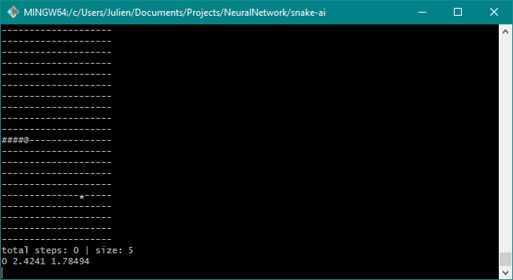

----------
# Table of Contents

1. [About](#about)
2. [Neural Network Design](#neural-network-design)
3. [Training](#training)
4. [Results](#results)
5. [Results (round 2)](#results-round-2)
6. [Next Steps](#next-steps)


## About

I originally started working on this project since I was interested in learning about machine learning and neural networks. This is the result of reading articles on neural networks and genetic algorithms from articles online, and putting them into code.

I have implemented a neural network, and a genetic algorithm capable of doing roulette wheel selection, crossover operations, and mutation operations. 

## Neural Network Design

The neural network has 25 input nodes and 3 output nodes + varying numbers of hidden layers and nodes.
 - The output nodes simply represent the direction that the snake should turn (either left, right, or continue going straight).
 - The input nodes are calculated as follows:
``` 
 * All values are relative to the head's facing
 * Assign the following indices a value depending on what position they are in:
 * (i.e. input[0] is assigned the value of whatever is 2 in front and 2 to the left of the snake's head)
 * 
 *    0  1  2  3  4
 *    5  6  7  8  9
 *    10 11 H  12 13    H is the snake's head
 *    14 15 B  16 17    B is body (this is guaranteed for length > 1)
 *    18 19 20 21 22
 * 
 * Values are assigned as follows:
 * Wall        = -1
 * Body part   = -.5
 * Empty space = 0
 * Fruit       = 1
 * (If block is out of bounds, treat it the same as a wall)
 * 
 * The final two indices are to keep track of the location of the fruit relative to the head
 * input[23] = (fruit x == head x) ? 1 : 0.5 / (fruit x - head x)
 * input[24] = (fruit y == head y) ? 1 : 0.5 / (fruit y - head y)
 * (note, this calculation is of course modified so that it's relative to the snake's facing)
 ```

Everything is relative to the snake's facing since it doesn't matter which direction it is facing in; If it's given the same input while facing left or down, it should still make the same decision as to where to turn.

As for the hidden layers/nodes, I have found that 4 hidden layers with 10 nodes each seems to work well, but I will continue to do more testing.

## Training 

Currently using a population of 1000, mutation rate of 10% and a crossover rate of 70%. 

Each training cycle, I iterate through all the snakes, and have them do 5 run-throughs of the game (to reduce the effect of lucky fruit generation). Each game ends once the snake dies, or once the snake has gone 100 steps without haven eaten anything (this is to kill any infinte loops, though maybe changing this value might produce more efficient snakes?). The fitness of each snake is then calculated and averaged over the 5 runs.

I then sort every snake by its fitness and kill off the weaker half. Then using roulette wheel selection (random selection that is biased towards higher fitness snakes), I choose two snakes and have them 'mate' to produce two new snakes that get added to the population.

I originally calculated fitness as simply `(fruits eaten)^2`. I am continuously changing this calculation (see below) to try and come up with better snakes.

## Results

The first snakes were generated using the `(fruits eaten)^2` fitness calculation. Let's take a look at the best snakes from a few generations

### Generation 1
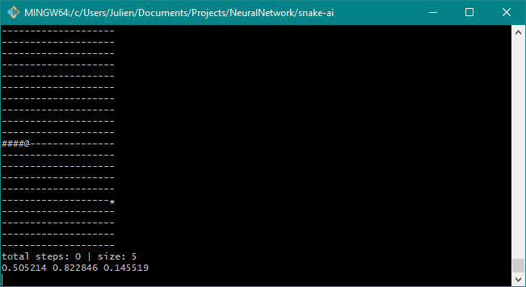

Classic generation 1 snakes... not very good.

### Generation 2
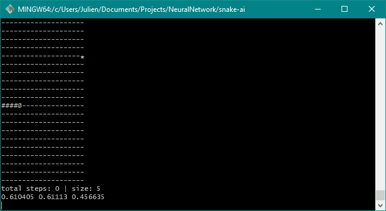

Looks like everything is going well, and then the snake decides that making circles is a better use of its time


### Generation 3
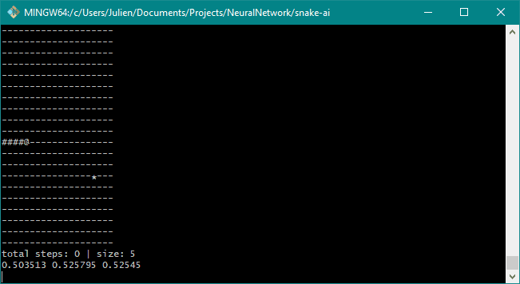

Alright, progress! The snake is able to hunt down a fruit.

### Generation 5
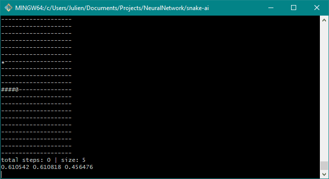

Seems to be hunting down fruits better, but also discovered how to collide into itself.

### Generation 10
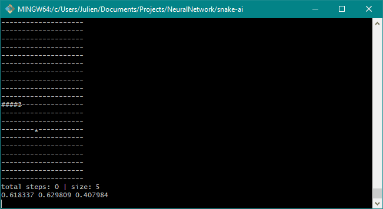

Does really well, and then suddenly decides to go on a diet and stop eating fruits...

### Generation 35


At this stage the snakes seem to be performing quite well.

----------

... However! If you've been paying attention, you'll notice that none of these snakes ever takes a right turn...

While these snakes might be efficient, they aren't very interesting to watch...

Time to change the fitness function:
 - Same as before, but if the snake never makes a left turn or never makes a right turn, we set the fitness to 0.

### Results (round 2)

### Generation 1
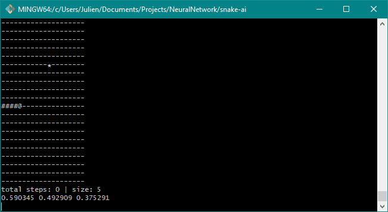

Classic generation 1 snakes... not very good.

### Generation 17
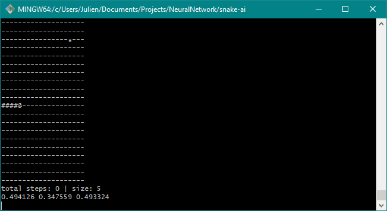

Ahh, that looks more interesting now. Note that because of the stricter fitness calculation, the learning takes a lot longer...

### Generation 35
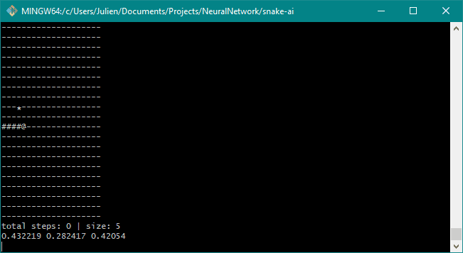

### Generation 67
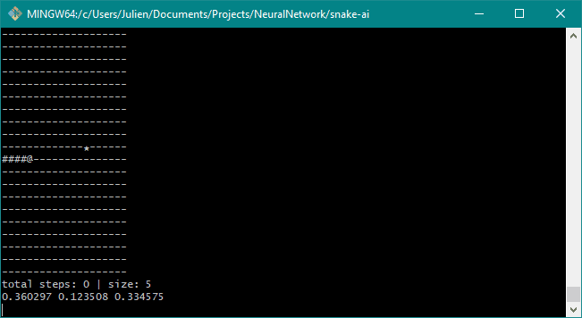

The snake still seems to be scared of the edges

### Generation 105
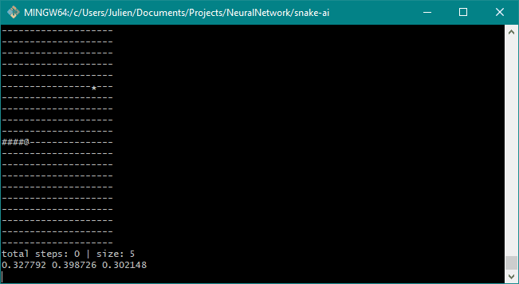

And here we go, even with the fitness restriction, we return to our left turning snakes...

### Generation 147
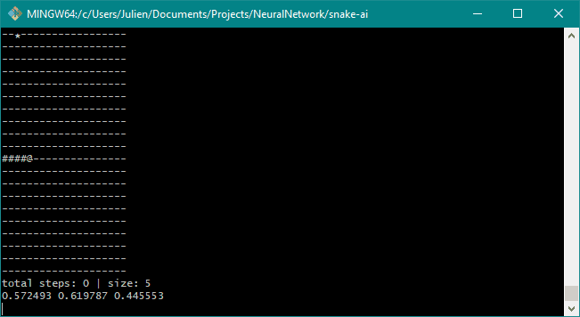

Not too sure why this one decides to headbutt the wall at the end

### Generation 181
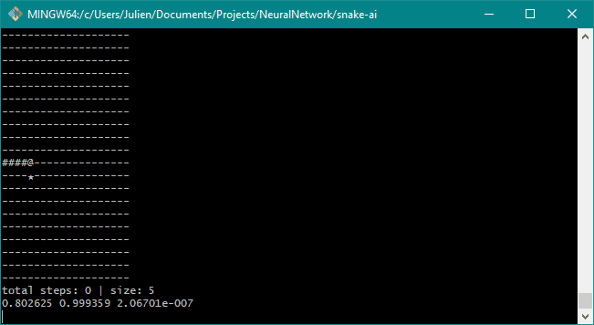

### Generation 200
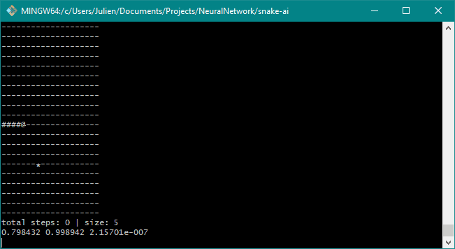

The snake hits a length of 50! It has some very interesting movement and dodges towards the end of its life 


----------
----------


## Next Steps

Do more training! Change the fitness functions, maybe do some calculations regarding the number of steps the snake took?

Add better visuals to the program (i.e. non console stuff)

Apply neural network to other things


----------
:snake:
